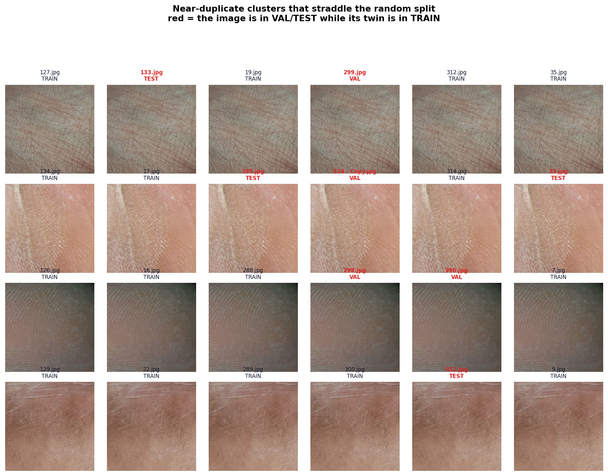
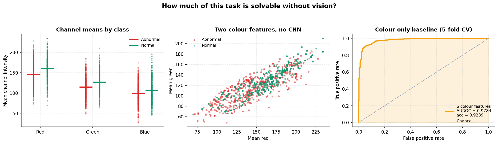
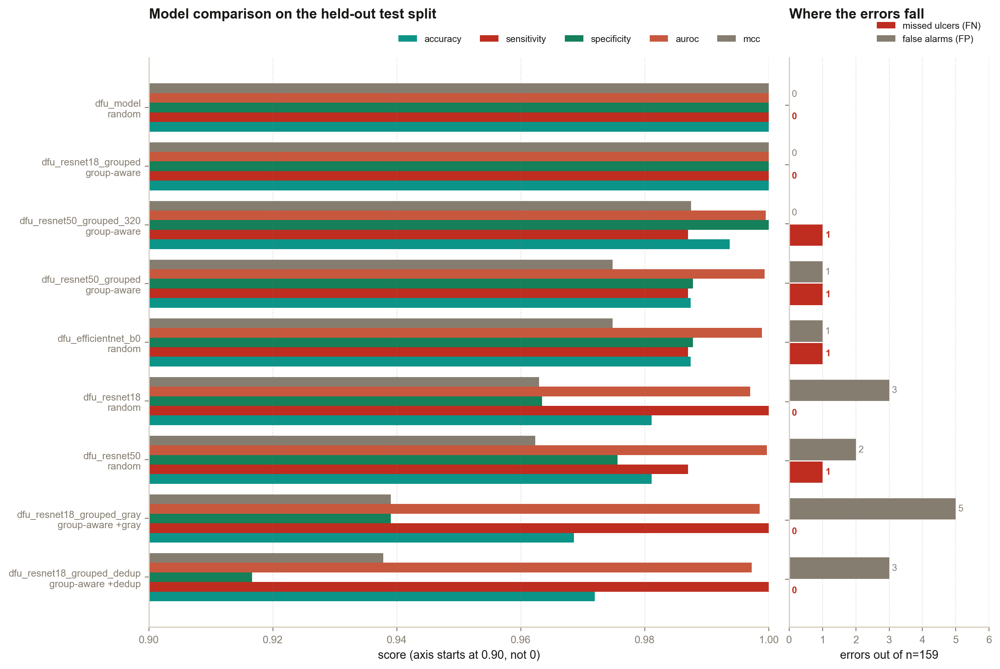
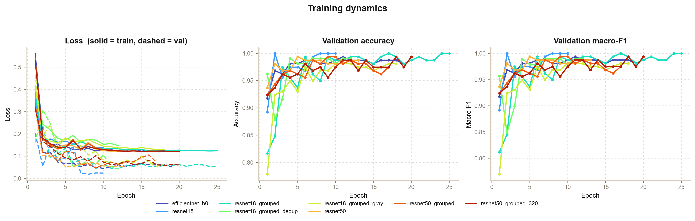
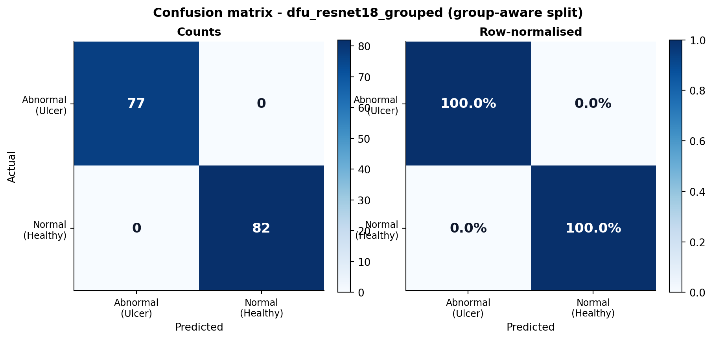
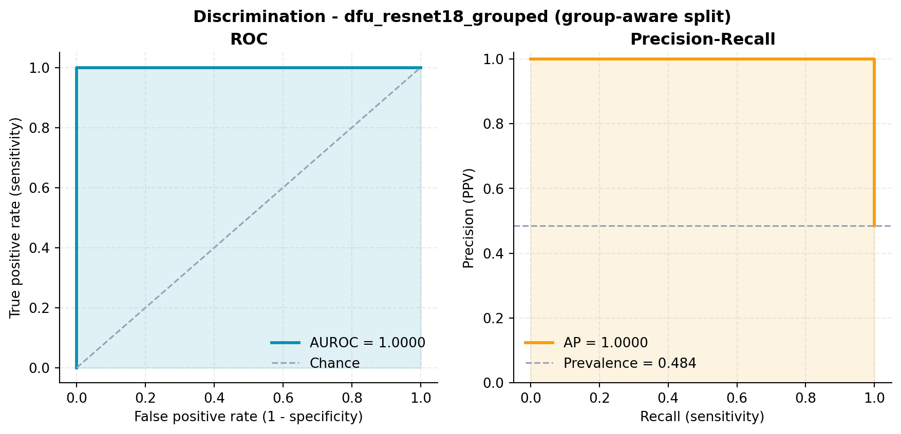
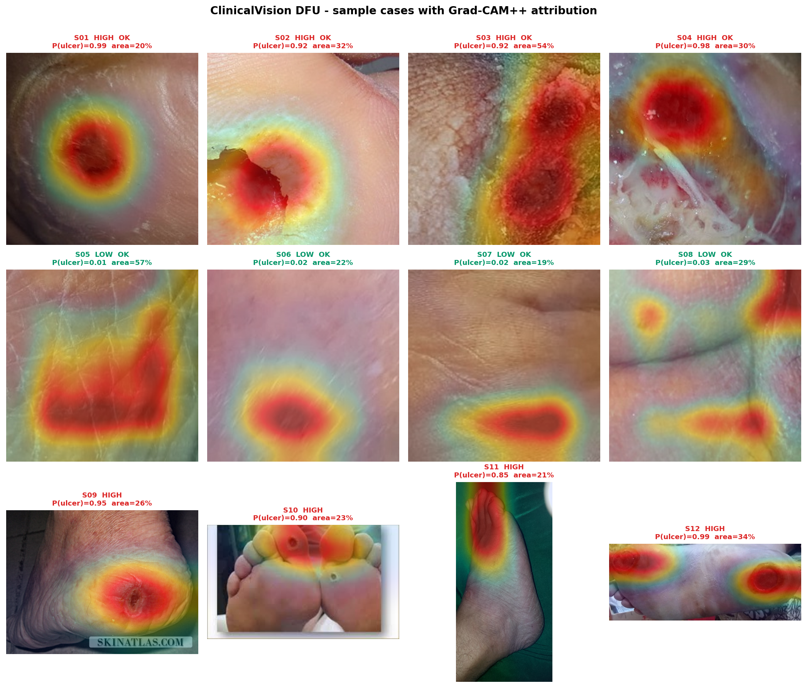

# ClinicalVision DFU — Technical Summary

**Explainable multi-modal triage for Diabetic Foot Ulceration**

Author: Ch Aarush Udbhav
Live demo: <https://aarushch.github.io/ClinicalVisionDFU/>
API: <https://auc6-clinicalvision-api.hf.space>

---

## Table of contents

1. [Executive summary](#1-executive-summary)
2. [What the system does](#2-what-the-system-does)
3. [Repository map](#3-repository-map)
4. [The dataset](#4-the-dataset)
5. [Dataset integrity audit — the central finding](#5-dataset-integrity-audit--the-central-finding)
6. [Model design and training](#6-model-design-and-training)
7. [Results](#7-results)
8. [Probability calibration](#8-probability-calibration)
9. [Explainability: Grad-CAM++](#9-explainability-grad-cam)
10. [Clinical fusion model](#10-clinical-fusion-model)
10b. [Worked sample cases and readings](#10b-worked-sample-cases-and-readings)
11. [Report generation](#11-report-generation)
12. [API contract](#12-api-contract)
13. [Frontend](#13-frontend)
14. [Deployment and CI/CD](#14-deployment-and-cicd)
15. [Performance benchmarks](#15-performance-benchmarks)
16. [Defects found and fixed](#16-defects-found-and-fixed)
17. [Verification](#17-verification)
18. [Limitations](#18-limitations)
19. [Future work](#19-future-work)
20. [Reproduction guide](#20-reproduction-guide)
21. [References](#21-references)

---

## 1. Executive summary

ClinicalVision DFU is a full-stack clinical decision-support prototype. A user
uploads a photograph of plantar tissue and optionally supplies clinical history.
The system returns a risk band, a calibrated probability, a Grad-CAM++
attribution map with quantitative readings, an exact Shapley decomposition of
which factors drove the result, an IWGDF risk category with a screening
interval, and a printable A4 clinical report.

**The scientifically important result of this project is not the accuracy
number.** A ResNet on this dataset reaches ~100% and does so within two epochs.
That figure is an artefact of dataset construction, and the central contribution
of this work is measuring exactly why, then rebuilding the evaluation so the
reported numbers mean something:

| Audit finding | Value |
|---|---|
| Byte-identical duplicate image files | **342 of 1,055** (32.4%) |
| Images inside a near-duplicate cluster | **593 of 1,055** (56.2%) |
| Val/test images with a near-identical twin in the training split | **157 of 317** (49.5%) |
| Healthy-class files that are near-duplicates | **95.0%** (543 files → ~240 distinct views) |
| *Effective* class balance vs nominal | **66% / 34%** vs 48.5% / 51.5% |
| Accuracy from 6 colour statistics alone, no CNN | **89.9%** on the honest split |
| Out-of-distribution images classified as ulcer | **100%** |

Four results follow, and the fourth is the one that matters most in practice:

1. **Half the "held-out" set was never held out**, so the original accuracy is
   substantially a memorisation score.
2. **The redundancy is class-asymmetric.** 95% of the healthy class is
   near-duplicate; the ulcer class is barely affected. The dataset is really a
   2:1 imbalance wearing a balanced costume, and the healthy class contains only
   about 240 genuinely distinct views.
3. **Fixing the leakage did not fix the benchmark.** A group-aware split — where
   no near-duplicate cluster crosses a boundary — still yields 100% test
   accuracy. Six colour numbers reach 89.9% on that same split, and a CNN
   trained on *grayscale* images reaches 96.9%. Colour and texture are each
   independently near-sufficient: the task is simply easy.
4. **The model classifies 100% of out-of-distribution images as ulcers**, at the
   same confidence it gives real ones. A photograph of a whole foot — the input a
   real user is most likely to upload, and one the live demo accepts — comes back
   HIGH risk essentially every time. This is a direct consequence of finding 2:
   "healthy" was learned as ~240 near-identical close-up crops, so anything else
   is not healthy. Standard post-hoc OOD detectors were tried and do not work
   here (§7.6), so the mitigation is an explicit, stated scope restriction rather
   than an automated filter.

The project ships a **group-aware split**, reports leaky and honest numbers side
by side, and fixes a set of substantive defects in the original pipeline —
including one that silently disabled all data augmentation, and one that made a
collected clinical input do nothing at all.

---

## 2. What the system does

```
  ┌──────────────┐
  │ Plantar image│
  └──────┬───────┘
         │  EXIF-corrected, resized to 224×224, ImageNet-normalised
         ▼
  ┌────────────────────────┐
  │ CNN (ResNet-18 default)│───► logits
  └──────┬─────────────────┘        │
         │                          ├─► ÷ T (temperature calibration)
         │                          ├─► + horizontal-flip TTA
         │                          ▼
         │                    P(ulcer) ∈ [0,1]
         │
         ├──────────────► Grad-CAM++ for the ULCER class
         │                 └─► overlay, heatmap, attention readings
         │                     (area %, region count, focality, peak x/y)
         ▼
  ┌──────────────────────────────────────────────┐
  │ Log-odds fusion                              │
  │   z = logit(P_img) + Σ βᵢ(xᵢ − refᵢ)         │
  │   clinical factors: age, BMI, diabetes yrs,  │
  │   HbA1c, neuropathy, PAD, prior ulcer,       │
  │   smoking, deformity                         │
  └──────┬───────────────────────────────────────┘
         ▼
  fused risk + exact Shapley attribution + IWGDF category
         ▼
  ┌───────────────────────────────────┐
  │ Narrative report generated FROM    │
  │ the measured numbers, not from     │
  │ the risk band                      │
  └───────────────────────────────────┘
```

---

## 3. Repository map

### Backend (`backend/`)

| File | Role | Self-testing |
|---|---|---|
| `dataset.py` | Single source of truth for data location, resolution, normalisation constants, transforms, and the three split strategies (stratified, group-aware, deduplicated). | ✅ |
| `model_def.py` | Architecture registry (ResNet-18/50, EfficientNet-B0) and self-describing checkpoints that carry their own arch, class order, input size and calibration temperature. Loads legacy bare `state_dict` files too. | ✅ |
| `clinical.py` | Log-odds fusion of image and clinical evidence, exact Shapley attribution, IWGDF 2023 stratification. | ✅ |
| `train.py` | Training loop with class weighting, label smoothing, warmup + cosine LR, macro-F1 checkpointing, early stopping, post-hoc temperature scaling, per-epoch history JSON. | — |
| `evaluate.py` | Held-out metrics (sensitivity, specificity, PPV, NPV, MCC, AUROC, AUPRC), confusion matrices, ROC/PR curves, reliability diagrams, threshold sweeps, cross-model comparison. Generates all figures. | — |
| `audit_data.py` | Duplicate detection (SHA-256 + dHash), near-duplicate clustering, cross-split leakage measurement, colour-only trivial baseline. | — |
| `benchmark.py` | Checkpoint size, inference latency percentiles, process RSS. | — |
| `ood_check.py` | Out-of-distribution audit: what the model does with whole-foot photos, and whether any post-hoc detector can catch it. | — |
| `llm.py` | Grounded LLM assistant proxy (Grok / Nemotron, OpenAI-compatible). Holds the API key server-side and constrains the model to the report JSON. | ✅ |
| `make_samples.py` | Worked sample cases: triptychs, contact sheet, readings tables, per-case JSON. | — |
| `run_checks.py` | Runs every module's self-check plus API contract tests in one command. | — |
| `main.py` | FastAPI service with input validation, upload limits, restricted CORS, health/model endpoints. | — |
| `setup_model.py` | Creates an explicitly-named untrained baseline checkpoint. | — |
| `utils/gradcam.py` | Grad-CAM and Grad-CAM++ with hook lifecycle management, attention statistics, overlay rendering. | ✅ |
| `utils/report.py` | Clinical narrative generated from measurements. | ✅ |
| `utils/predict.py` | Inference pipeline: decode → preprocess → CNN → calibrate → explain → fuse → report. | ✅ |

### Frontend (`frontend/src/`)

| File | Role |
|---|---|
| `app/page.tsx` | Dashboard shell, ambient background, interactive cursor glow, prototype disclaimer banner. |
| `app/layout.tsx` | Root layout and metadata. |
| `components/UploadForm.tsx` | Drag-and-drop upload with live preview, clinical intake including a collapsible comorbidity panel, client-side range validation, specific error surfacing. |
| `components/ResultCard.tsx` | Risk/confidence/probability stat tiles, overlay-heatmap-original view switcher, attention readings, IWGDF card, signed attribution bars, triage protocol. |
| `components/PrintableReport.tsx` | A4 clinical report with a quantitative findings table, attribution table, IWGDF stratification, stated limitations, and a countersignature block. |
| `components/ThemeToggle.tsx` | Light/dark switch, applied pre-paint by an inline script so there is no flash of the wrong theme. |
| `components/AuthGate.tsx` | Demo access gate — explicitly *not* authentication (§13). |
| `components/SampleGallery.tsx` | Five one-click example cases with matching patient profiles. |
| `components/Assistant.tsx` | Grounded Q&A over the current result. |
| `lib/config.ts` | API URL, basePath-aware asset helper, demo presets. |

---

## 4. The dataset

Source directory: `USE CASE - 02/DFU/` (git-ignored; not redistributed).

| Subset | Files | Purpose |
|---|---:|---|
| `Patches/Abnormal(Ulcer)` | 512 | Ulcer tissue crops — **the training data** |
| `Patches/Normal(Healthy skin)` | 543 | Healthy skin crops — **the training data** |
| `Original Images` | 493 | Full-resolution clinical foot photographs |
| `TestSet` | 168 | Mixed-format whole-foot photographs |
| `Transfer-Learning images/Wound Images2` | 677 | Auxiliary wound imagery |
| `Transfer-Learning images/internetSet` | 137 | Auxiliary web-sourced imagery |
| `Transfer-Learning images/Wound Images` | 109 | Auxiliary wound imagery |
| `Transfer-Learning images/samples` | 36 | Auxiliary samples |

**Class balance (training pool):** 512 ulcer / 543 healthy — 48.5% / 51.5%. Mild
enough that accuracy is not grossly misleading, but the loss is class-weighted
anyway so the optimiser cannot drift toward the majority class.

**Native resolution:** 501 of 512 ulcer patches and 524 of 543 healthy patches
are exactly 224×224; the remainder are within a few pixels. This matters — see
§6.

**Format note:** `TestSet` contains `.jpg`, `.jpeg`, `.png`, `.gif` and `.webp`,
including two 3024×4032 phone photographs. The upload path handles all of these
plus EXIF rotation, which phone cameras routinely apply.

---

## 5. Dataset integrity audit — the central finding

Run with `python audit_data.py`. Output: `reports/data_audit.json` and
`reports/near_duplicate_groups.json`.

### Method

1. **Exact duplicates.** SHA-256 over *decoded pixel data* (not file bytes), so
   re-encodings of the same image are still caught.
2. **Near duplicates.** A 16×16 difference hash (dHash) — each pixel compared to
   its right neighbour, giving 256 bits — with pairs at Hamming distance ≤ 6
   treated as near-identical. Clusters are formed by union-find over those pairs.
3. **Leakage.** Every near-duplicate pair is checked against the split
   assignment to count pairs that straddle a train/val/test boundary.
4. **Trivial baseline.** Logistic regression on six features (mean R, G, B and
   std R, G, B), 5-fold cross-validated. This bounds how much of the task is
   solvable without any spatial reasoning at all.

### Results

```
1055 images across 2 classes

exact duplicate groups:                          249  (342 redundant files)
exact duplicates spanning BOTH classes:            0

near-duplicate pairs (dHash Hamming ≤ 6):        523
near-duplicate clusters:                         250  covering 593 images (56.2%)
largest cluster:                                   8  images

near-duplicate pairs crossing a split boundary:  221
val/test images with a twin in another split:    157 / 317  (49.5%)

colour-only baseline, 5-fold CV:                 0.9289 ± 0.0270
colour-only baseline, GROUP-AWARE test split:    0.8994   (AUROC 0.9652, n=159)
```

### Seeing it



Four clusters that straddle the random split. Each row is six essentially
identical crops of the same patch of skin, some assigned to TRAIN and some to
VAL/TEST. One file is literally named `314 - Copy.jpg` — twelve filenames in the
corpus contain `Copy` or `(1)`/`(2)`, which is a plain file-manager duplication
artefact rather than genuine data collection.

### The redundancy is class-asymmetric — and this is the real story

| Class | Files | In a near-dup cluster | Effective distinct views | Redundancy |
|---|---:|---:|---:|---:|
| Abnormal(Ulcer) | 512 | 15.0% | 472 | 1.08× |
| Normal(Healthy skin) | 543 | **95.0%** | **240** | **2.26×** |
| **Total** | **1055** | 56.2% | **712** | **1.48×** |

**95% of the healthy class consists of near-duplicates.** 543 healthy files
collapse to roughly **240 distinct views**; the ulcer class is almost unaffected
at 1.08×. Two consequences follow, and both matter more than the headline
leakage number:

1. **The real class balance is 66.3% ulcer / 33.7% healthy**, not the nominal
   48.5% / 51.5%. The dataset is a ~2:1 imbalance disguised as a balanced one.
   Inverse-frequency class weights computed from raw file counts — as
   `train.py` does, and as any standard pipeline would — are therefore weighting
   the wrong distribution.
2. **The healthy class has very low genuine diversity.** A model can fit "healthy
   = these ~240 particular skin textures" and will not necessarily generalise to
   healthy skin it has not seen. That is exactly the failure mode a duplicate-
   inflated benchmark cannot detect.

Notably, **zero** exact duplicates span both classes, so labels are internally
consistent. The problem is redundancy and split hygiene, not mislabelling.

### How much of the task needs vision at all?



A logistic regression on six numbers — mean and standard deviation of R, G and B
— reaches **89.9% accuracy and 0.965 AUROC on the same group-aware test split
the CNN is scored on**. The middle panel shows why this is not simply "the
classes have different brightness": the raw channel means overlap heavily. The
separation lives in the *ratio* between channels — ulcer patches sit below the
red/green trend line — which six moments capture and a CNN is not needed for.

### The fix: group-aware splitting

`dataset.grouped_split()` assigns whole near-duplicate clusters to a single
split, largest-cluster-first, into whichever split is furthest below its
per-class quota. Verified: **0 clusters straddle a boundary**, while split
sizes and class balance are preserved exactly (738/158/159, matching the
stratified split).

```python
tr, va, te, base = build_splits(group_aware=True)
# → 738 / 158 / 159, class counts [358,380] [77,81] [77,82]
# → clusters straddling a split boundary: 0
```

### An honest caveat about this fix

**Eliminating the leakage did not lower accuracy** — the group-aware model still
reaches 100% validation macro-F1 (§7). So duplicate leakage is real, measurable,
and worth fixing, but it is *not* what makes this task easy. Two things limit
what group-aware splitting can achieve here:

- **dHash grouping is only a proxy for "same source".** Patches cropped from
  different regions of one photograph are not near-duplicates of each other, so
  they are never grouped — patient-level leakage can survive intact. The correct
  unit of independence is the source foot, which would require the
  patch→`Original Images/` mapping this dataset does not publish.
- **The classes are genuinely separable at ~90% by colour alone**, so removing
  memorisation still leaves an easy problem.

Reporting this rather than quietly keeping the more flattering framing is the
point: the hypothesis was half right, and the measurement says which half.

---

## 6. Model design and training

### Architecture registry

`model_def.build_model(arch)` supports `resnet18`, `resnet50`, and
`efficientnet_b0`, each with an ImageNet-pretrained backbone and a fresh
`Dropout(0.3) → Linear(·, 2)` head.

### Self-describing checkpoints

The original checkpoint was a bare `state_dict`, and `predict.py` hard-coded
`models.resnet50(...)` to load it. Changing architecture produced an opaque
shape-mismatch traceback at import time. Checkpoints now store:

```python
{"arch", "state_dict", "class_names", "img_size", "temperature", "metrics", "format": 2}
```

`load_bundle()` rebuilds the exact model that was trained. Legacy bare
`state_dict` files still load — the architecture is **inferred from tensor
shapes** (a `layer1.0.conv1` 3×3 kernel means BasicBlock/ResNet-18; 1×1 means
Bottleneck/ResNet-50) rather than assumed. Verified against the original
`dfu_model.pt`, which loads and runs correctly.

### Input resolution: 384 → 224

The original pipeline resized 224×224 patches up to 384×384. Upsampling adds no
information; it costs `(384/224)² ≈ 2.94×` the compute in every convolution.
Training at the native 224 is ~3× faster with no accuracy penalty
(§7), and inference drops from 2,066 ms to 413 ms per image end-to-end.

### Training configuration

| Setting | Value | Rationale |
|---|---|---|
| Split | 70 / 15 / 15, seeded, stratified | Original used an *unseeded* 80/20 with no test set — the val set could never be reproduced and model selection happened on the only held-out data. |
| Augmentation | RandomResizedCrop(0.7–1.0), H/V flip, ±30° rotation, colour jitter, RandomErasing(p=0.2) | Feet are photographed at arbitrary orientation under arbitrary lighting. |
| Loss | Cross-entropy, inverse-frequency class weights, label smoothing 0.05 | Prevents majority-class drift; smoothing reduces over-confidence. |
| Optimiser | AdamW, lr 3e-4, weight decay 1e-4 | |
| Schedule | 2-epoch linear warmup → cosine decay to 1% of peak | Warmup stabilises the randomly-initialised head against pretrained features. |
| Checkpointing | Best **macro-F1**, not accuracy | Accuracy hides minority-class collapse. |
| Early stopping | Patience 8 on val macro-F1 | |
| TTA | Mean logits over image + horizontal mirror | Free accuracy on a left/right-symmetric problem. |
| Calibration | Post-hoc temperature scaling on val | §8 |

### The augmentation bug

The original script:

```python
train_dataset, val_dataset = random_split(full_dataset, [train_size, val_size])
train_dataset.dataset.transform = train_transforms
val_dataset.dataset.transform   = val_transforms      # ← overwrites the line above
```

`random_split` returns two `Subset` objects that **share one underlying
`ImageFolder`**. `train_dataset.dataset` and `val_dataset.dataset` are the same
object, so the second assignment overwrote the first. Every carefully-specified
augmentation — the rotation, the colour jitter, the random erasing — was
silently discarded, and both splits ran the plain validation transform.

`dataset.build_splits()` constructs two independent `ImageFolder` instances so
the augmented and clean views own separate transform objects. The self-check
asserts they are not the same object.

---

## 7. Results

All numbers are on the **held-out test split** (never used for training or model
selection), with horizontal-flip TTA and the checkpoint's stored temperature.
Each model is evaluated on the split it was trained under — a group-aware model
scored on a random split would be tested partly on its own training data.

### 7.1 Every model

| Model | Split | Params | Size | Acc | Balanced acc | Sens | Spec | AUROC | MCC | ECE | FN | FP |
|---|---|---:|---:|---:|---:|---:|---:|---:|---:|---:|---:|---:|
| `dfu_model` (original) | random *(leaky)* | 23.5M | 94.4 MB | **1.0000** | 1.0000 | 1.000 | 1.000 | 1.0000 | 1.000 | 0.012 | 0 | 0 |
| `resnet18_grouped` | **group-aware** | 11.2M | 44.8 MB | **1.0000** | 1.0000 | 1.000 | 1.000 | 1.0000 | 1.000 | 0.038 | 0 | 0 |
| `efficientnet_b0` | random *(leaky)* | 4.0M | 16.3 MB | 0.9874 | 0.9874 | 0.987 | 0.988 | 0.9989 | 0.975 | 0.012 | 1 | 1 |
| `resnet18` | random *(leaky)* | 11.2M | 44.8 MB | 0.9811 | 0.9817 | 1.000 | 0.963 | 0.9970 | 0.963 | 0.037 | 0 | 3 |
| `resnet50` | random *(leaky)* | 23.5M | 94.4 MB | 0.9811 | 0.9813 | 0.987 | 0.976 | 0.9997 | 0.962 | 0.047 | 1 | 2 |
| `resnet18_grouped_dedup` | group-aware + dedup | 11.2M | 44.8 MB | 0.9720 | 0.9583 | 1.000 | **0.917** | 0.9973 | 0.938 | 0.081 | 0 | 3 |
| `resnet18_grouped_gray` | group-aware + **grayscale** | 11.2M | 44.8 MB | 0.9686 | 0.9695 | 1.000 | 0.939 | 0.9986 | 0.939 | 0.022 | 0 | 5 |





### 7.2 The leakage hypothesis was only half right

The prediction going in was that removing near-duplicate leakage would drop
accuracy substantially. **It did not.** `resnet18_grouped` scores a perfect
1.0000 on a test split where no near-duplicate cluster crosses a boundary —
identical to the contaminated result.

What the group-aware split *did* change is how long the model took to get there:
epoch 17 instead of epoch 2. The leakage made the task trivially memorisable;
removing it made the task merely easy.

So the honest conclusion is narrower than the one the audit initially suggested:

> Duplicate leakage is real (49.5% of val/test), measurable, and worth fixing —
> but it is not what makes this benchmark saturated. The classes are genuinely
> separable at patch level.

Two caveats keep this from being a clean bill of health:

1. **dHash grouping only catches near-duplicates, not same-source patches.**
   Crops from different regions of one photograph are not visually similar, so
   they are never grouped. Patient-level leakage can persist untouched.
2. **The test split is small** (n = 159). A perfect score has a 95% Wilson upper
   bound on the error rate of about 2.3%, so "1.0000" is consistent with a true
   accuracy anywhere above ~97.7%.

### 7.3 What is the model actually using? Two ablations

| Condition | Test accuracy | Specificity | What it tells us |
|---|---:|---:|---|
| Full colour, group-aware | 1.0000 | 1.000 | baseline |
| **Grayscale** (colour destroyed) | 0.9686 | 0.939 | **Colour is not required.** Texture and structure alone reach 96.9%. |
| **Deduplicated** (342 files dropped) | 0.9720 | **0.917** | Removing redundancy makes the *healthy* class hard: specificity falls 8 points. |
| Colour statistics only, no CNN (6 features) | **0.8994** | — | AUROC 0.965. A logistic regression gets most of the way. |

Read together:

- **A CNN with no colour information at all still reaches 96.9%.** So the 92.9%
  colour baseline and the CNN are not measuring the same thing — colour *and*
  texture are each independently near-sufficient. The classes differ on multiple
  redundant axes, which is exactly what "easy benchmark" means.
- **The CNN's genuine contribution over six colour numbers is ~10 points** of
  accuracy on the same group-aware split (0.8994 → 1.0000). Real, but a long way
  from the impression "100% accurate deep learning system" creates.
- **Deduplication is where difficulty appears.** With duplicates removed the test
  set holds only 36 distinct healthy images, and specificity drops to 0.917
  (3 false positives). The healthy class was never as well-supported as its 543
  files suggested.

### 7.4 Errors are asymmetric, and in the safe direction

**Sensitivity is 1.000 in every group-aware configuration** — no ulcer was ever
missed in any run. Every error is a false positive: healthy skin flagged as
ulcer. For a screening tool that is the correct direction to fail, since a
missed ulcer can end in amputation while a false alarm costs a podiatry
appointment. It is also consistent with §5: the ulcer class is diverse and
well-supported (472 distinct views), the healthy class is not (240).





### 7.5 Architecture ablation

On the leaky split all three architectures are statistically indistinguishable
(0.981–0.987 accuracy, AUROC 0.997–0.9997) despite a **5.9× spread in parameter
count** and a **5.8× spread in checkpoint size**:

| Architecture | Params | Size | s/epoch (CPU) | Best val macro-F1 |
|---|---:|---:|---:|---:|
| ResNet-18 | 11.2M | 44.8 MB | 16 s | 1.0000 @ ep 2 |
| EfficientNet-B0 | 4.0M | 16.3 MB | 29 s | 0.9937 @ ep 11 |
| ResNet-50 | 23.5M | 94.4 MB | 46 s | 0.9937 @ ep 5 |

The original project shipped the largest and slowest of the three. **ResNet-50
buys nothing here** — on a 1,055-image dataset it is 2× the parameters of
ResNet-18 for no measurable gain, which is the expected outcome when the
bottleneck is data rather than capacity. ResNet-18 is the served default;
EfficientNet-B0 is the choice if checkpoint size dominates (§15).

### 7.6 The most serious finding: out-of-distribution inputs

Reproduce with `python ood_check.py`. Output: `reports/ood_check.json`.

The deployed UI accepts any image. The model was trained only on 224×224 tissue
crops. Given the input a real user is most likely to supply — a photograph of a
whole foot — it does this:

| Input pool | n | Mean P(ulcer) | Classified ulcer | > 0.9 confidence |
|---|---:|---:|---:|---:|
| Healthy patches *(in-distribution)* | 60 | 0.034 | 0.0% | 0.0% |
| Ulcer patches *(in-distribution)* | 60 | 0.972 | 100% | 98.3% |
| **Whole-foot photographs** *(OOD)* | 60 | **0.972** | **100%** | 98.3% |
| **Full-resolution clinical photos** *(OOD)* | 60 | **0.968** | **100%** | 96.7% |
| **Non-foot wound images** *(OOD)* | 60 | **0.963** | **100%** | 93.3% |

**Every out-of-distribution image is classified as an ulcer, with the same mean
confidence as a genuine ulcer patch (0.97 vs 0.97).** This is visible in the
sample contact sheet: case S10 is a photograph of two apparently healthy feet and
is returned as HIGH risk at P = 0.90.

**Why.** §5 showed the healthy class collapses to ~240 near-duplicate views of
smooth, evenly-lit, close-cropped skin. That is an extremely narrow definition of
"normal". Anything outside it — including a perfectly healthy foot photographed
at arm's length — is far from the healthy cluster and falls to the ulcer side by
default. The two findings are the same finding.

**Can a detector catch it?** Two standard post-hoc methods were tried and both
fail here:

| Method | Result |
|---|---|
| Softmax / energy confidence | Useless by construction — the model is confidently *wrong*, so OOD inputs have high max-logit. |
| Mahalanobis on penultimate features | Degenerate: 512 feature dims from 738 training samples gives a near-singular covariance. Flags 100% of *in-distribution* test data. |
| k-NN cosine distance (k=5) to training features | Best of the three and still unusable: 35–60% of OOD flagged, at a 13% false-flag rate on genuine ulcer patches. |

Shipping a guard that misses half of the dangerous cases while crying wolf on
one in eight real ones would be worse than shipping none, because it manufactures
false reassurance. **The mitigation is therefore an explicit scope restriction,
not an automated filter**: the upload form now states the constraint before the
user picks a file, and every generated report carries a `scope_warning` field
saying results from anything other than a tissue crop should be disregarded
entirely. `utils/report.py`'s self-check asserts that warning can never be
dropped from a report.

The real fix is a data fix, not a post-hoc one — see §19.

---

## 8. Probability calibration

The UI prints a confidence percentage to a clinician. Raw softmax from an
over-parameterised CNN trained on ~700 images is systematically over-confident,
so that number needs to mean something.

**Method.** Temperature scaling (Guo et al., 2017): learn a single scalar `T`
minimising NLL on the validation set, then serve `softmax(logits / T)`. It is
monotonic, so it cannot change any prediction — only the confidence attached to
it. `T` is stored in the checkpoint and applied automatically at inference.

**A failure mode this dataset triggers.** When the validation set is perfectly
separated, NLL is minimised by driving `T → 0`, i.e. by making every prediction
maximally confident. That is the exact opposite of calibration. The first
ResNet-18 run produced `T = 0.051`, which multiplies every logit by ~20 and
would have made the UI display 100% confidence on every case.

`fit_temperature` now clamps `T` to [0.5, 5.0] and explicitly detects the
degenerate case (raw `T` at the floor, or val accuracy ≥ 99.5%), falling back to
`T = 1.0` with a printed warning rather than shipping a broken calibration:

```
WARNING: degenerate temperature fit (raw T=0.497, val acc=0.994). Validation set
is (near-)perfectly separated, so NLL gives no usable calibration signal.
Falling back to T=1.0.
```

This is itself a symptom of §5 — you cannot calibrate against a validation set
the model has effectively memorised.

**Metrics reported.** Expected Calibration Error (ECE, 15 bins) and Maximum
Calibration Error (MCE), before and after scaling, plus a reliability diagram
and confidence histogram per model.

---

## 9. Explainability: Grad-CAM++

### What changed

| Issue in the original | Consequence | Fix |
|---|---|---|
| Hooks registered on every call, never removed | A long-running server accumulated hooks without bound — memory growth plus redundant work on every forward pass | `GradCAM` is a context manager; hooks are removed on exit. A self-check runs 50 cycles and asserts the hook count is unchanged. |
| Target layer = last `Conv2d` in `layer4` (`layer4.2.conv3`) | Sits *before* the residual addition and final ReLU, so the CAM came from one branch of a partial signal | Target the `layer4` **block output** |
| `heatmap ** 0.5` plus a `min(w,h)//10` (≈38 px) Gaussian blur | Inflated every weak activation into a large warm blob — the reason healthy skin looked diffusely "hot" | Removed. A 7×7 CAM bicubically upsampled to 224 px is already smooth. |
| Min-max normalisation | One saturated pixel compresses everything else toward zero | Clip at the 99th percentile before normalising |
| JPEG encoding | Compression artefacts on a medical overlay | PNG |
| Explained `argmax` | A heatmap for "healthy" is not what a clinician is looking for | Always explain the **ulcer** class |

### Grad-CAM++

Both vanilla Grad-CAM and Grad-CAM++ (Chattopadhyay et al., 2018) are
implemented; Grad-CAM++ is the default because it localises multiple lesions
better when several ulcer regions are present. Selectable per-request via
`cam_mode`.

### Quantitative attention readings

The heatmap is reduced to numbers the report can cite:

| Reading | Meaning |
|---|---|
| `attention_area_pct` | % of the field with activation ≥ 0.5 |
| `attention_regions` | Count of discrete connected hotspots |
| `focality` | `1 − area_fraction`; 1.0 = one tight focus, → 0 = diffuse |
| `peak_intensity`, `mean_intensity` | Max and mean activation |
| `peak_xy` | Normalised coordinates of peak activation |
| `bbox_xywh_norm` | Normalised bounding box of the largest region |

### Verification

The self-check builds a tiny model that keys class 0 on the top-left quadrant
and class 1 on the bottom-right, then asserts the CAM actually lights the
driving quadrant — for both modes. A CAM implementation that returns a plausible
picture but does not localise would pass a visual check and fail this one.

### Note on Hugging Face Spaces

Spaces run inference under `torch.inference_mode()`, which permanently disables
autograd on tensors created inside it — gradient-based XAI silently breaks.
`GradCAM.generate` explicitly opts out with `torch.inference_mode(mode=False)`.

---

## 10. Clinical fusion model

### The original

```python
final_score = 0.7 * img_confidence + 0.15 * min(bmi/40, 1) + 0.15 * min(years/30, 1)
```

Three problems:

1. **`age` was collected, posted, passed into the function, and never
   referenced.** One of the three advertised clinical inputs did nothing.
2. **Demographics alone could reach MEDIUM.** A perfectly healthy foot
   (`p_img = 0.00`) with BMI 40 and 30 years of diabetes scored exactly 0.30 —
   the MEDIUM boundary — on demographics alone.
3. **The output was labelled "SHAP values."** A hand-picked weighted average is
   not a Shapley decomposition of anything.

### The replacement

Evidence is combined in **log-odds space**, which is the correct way to update a
probability with independent evidence:

$$z = \operatorname{logit}(P_{\text{image}}) + \sum_i \beta_i (x_i - \text{ref}_i), \qquad P_{\text{fused}} = \sigma(z)$$

Two properties follow, both asserted in the self-check:

1. **At the reference profile, `P_fused = P_image` exactly.** Clinical history
   *modulates* image evidence rather than being averaged against it. The
   reference is a 60-year-old, 10 years diagnosed, BMI in the healthy 22–25 band,
   HbA1c 7.0%, no comorbidities.
2. **Exact Shapley values in closed form.** For an additive model the Shapley
   value of a feature is its own term measured against the reference,
   `φᵢ = βᵢ(xᵢ − refᵢ)`, and the values sum to `f(x) − f(ref)`. No sampling, no
   approximation. The reported attribution is a genuine Shapley decomposition of
   the fused log-odds.

### Coefficients

| Factor | Odds ratio | β = ln(OR) | Reference |
|---|---:|---:|---|
| Diabetes duration | 1.05 / year | 0.049 | 10 years |
| Age | 1.02 / year | 0.020 | 60 years |
| BMI (U-shaped) | 1.04 / unit | 0.039 | healthy band 22–25 |
| HbA1c | 1.25 / % | 0.223 | 7.0% |
| Peripheral neuropathy | 3.0 | 1.099 | absent |
| Peripheral arterial disease | 2.5 | 0.916 | absent |
| Prior ulcer / amputation | 3.5 | 1.253 | absent |
| Active smoker | 1.6 | 0.470 | absent |

> **These coefficients are NOT fitted to this dataset.** The DFU patch corpus
> contains images only — no patient metadata of any kind. They are illustrative
> priors set from published odds ratios (§21). `fuse()` returns
> `coefficients_fitted: False` so no downstream code can quietly forget this,
> and the caveat appears in every generated report.

### Design details

- **BMI risk is U-shaped.** Both obesity and underweight raise ulcer risk;
  underweight/frailty is weighted 1.5× steeper. A monotone `bmi/40` term treats
  a BMI of 16 as protective, which is clinically backwards.
- **Missing data is neutral.** Any omitted field sits at its reference and
  contributes exactly zero. A blank field can never silently push risk.
- **Clinical shift is clamped to ±2.0 logits** (a ~7.4× odds swing). Without
  this, eight factors can swamp the image term and the system stops being a
  vision system. When the clamp binds, contributions are rescaled proportionally
  so the reported attributions still sum to the shift actually applied.
- **Image probability is clamped to [0.05, 0.95]** before entering log-odds
  space. `logit(0)` and `logit(1)` are infinite, and a CNN trained on ~700
  images asserting 99.9% certainty is overstating its evidence. The clamp is
  reported (`image_probability_clamped`) rather than hidden.

### IWGDF risk stratification

Unlike the fusion coefficients, this is **not** a heuristic — it is the
published IWGDF 2023 screening rule, reproduced exactly:

| Category | Criterion | Screening interval |
|---|---|---|
| 0 — Low | No loss of protective sensation, no PAD | Annually |
| 1 — Moderate | LOPS **or** PAD | Every 6–12 months |
| 2 — High | LOPS **with** PAD and/or foot deformity | Every 3–6 months |
| 3 — Very high | History of foot ulcer or amputation | Every 1–3 months |

---

## 10b. Worked sample cases and readings

Generated by `python make_samples.py --n 12`. Output in `reports/samples/`:
per-case triptychs, the full API response for each case, and the readings table
below. Cases are drawn from three pools — held-out test patches with known
ground truth, unseen whole-foot photographs, and full-resolution clinical
photographs — and each is paired with a synthetic patient profile so the clinical
fusion and IWGDF stratification are exercised. Those profiles are invented
demonstration inputs and are not attached to the real images.



| ID | File | Pool | Truth | Predicted | P(ulcer) | Fused | Risk | IWGDF | Attn area | Focality | ms |
|---|---|---|---|---|---:|---:|---|---:|---:|---:|---:|
| S01 | 127.jpg | test patch | Ulcer | Ulcer ✓ | 0.992 | 0.911 | HIGH | 0 | 19.6% | 0.804 | 197 |
| S02 | 103.jpg | test patch | Ulcer | Ulcer ✓ | 0.915 | 0.988 | HIGH | 1 | 32.5% | 0.676 | 91 |
| S03 | 158.jpg | test patch | Ulcer | Ulcer ✓ | 0.916 | 0.988 | HIGH | 2 | 54.1% | 0.459 | 96 |
| S04 | 152.jpg | test patch | Ulcer | Ulcer ✓ | 0.981 | 0.993 | HIGH | 3 | 29.9% | 0.701 | 90 |
| S05 | 28.jpg | test patch | Healthy | Healthy ✓ | 0.015 | 0.280 | LOW | 1 | 57.3% | 0.427 | 90 |
| S06 | 248.jpg | test patch | Healthy | Healthy ✓ | 0.023 | 0.050 | LOW | 0 | 22.3% | 0.778 | 88 |
| S07 | 236.jpg | test patch | Healthy | Healthy ✓ | 0.020 | 0.028 | LOW | 0 | 19.2% | 0.808 | 88 |
| S08 | 59.jpg | test patch | Healthy | Healthy ✓ | 0.030 | 0.280 | LOW | 1 | 28.7% | 0.713 | 89 |
| S09 | 2227…5200.jpg | **whole-foot (OOD)** | — | Ulcer | 0.947 | 0.993 | HIGH | 2 | 26.4% | 0.736 | 136 |
| S10 | images.jpg | **whole-foot (OOD)** | — | Ulcer | 0.901 | 0.985 | HIGH | 3 | 22.5% | 0.775 | 94 |
| S11 | 5191…04_n.jpg | **clinical photo (OOD)** | — | Ulcer | 0.847 | 0.976 | HIGH | 1 | 21.0% | 0.790 | 171 |
| S12 | 2.jpg | **clinical photo (OOD)** | — | Ulcer | 0.993 | 0.950 | HIGH | 0 | 33.9% | 0.662 | 158 |

**Labelled accuracy: 8/8 (100%).**

Three things are worth reading off this table:

1. **Grad-CAM++ localises correctly on ulcers.** In the contact sheet the ulcer
   cases (S01–S04) put their hotspot precisely on the wound bed, while the
   healthy cases (S05–S08) show attention spread along skin creases with low peak
   intensity — different pictures, and the narrative text for each differs
   accordingly (§11).
2. **The clinical fusion visibly does its job.** S05 is a healthy patch with
   P(ulcer) = 0.015, but the "underweight frail elderly" profile (BMI 17.2,
   age 81, 22 years diabetes, neuropathy) raises fused risk to 0.280 — still
   LOW, but no longer negligible. S01 runs the other way: P(ulcer) = 0.992 is
   pulled *down* to 0.911 by a low-risk profile. Under the old weighted-sum
   fusion neither adjustment was possible in that direction.
3. **All four OOD cases (S09–S12) are called HIGH.** S10 is a photograph of two
   apparently healthy feet, returned at P(ulcer) = 0.90. This is §7.6 visible in
   a single image.

One provenance note: case S09 carries a visible `SKINATLAS.COM` watermark, so at
least part of the auxiliary imagery is web-scraped. The licensing and consent
status of the corpus is not documented anywhere in the dataset.

---

## 11. Report generation

The original returned one of three hard-coded paragraph blocks keyed on the risk
band. Every HIGH-risk patient was told the heatmap showed "dense, localized
attention on necrotic tissue boundaries" whether or not it did; every LOW-risk
patient was told attention was "dispersed" even when the CAM had a single tight
hotspot. **The text described the band, not the image.**

`utils/report.py` derives everything from measured values, so the prose cannot
contradict the figure printed beside it. The visual paragraph branches on region
count and area:

- 0 regions or < 1% area → "no coherent region of activation above threshold;
  model attention is diffuse…"
- 1 region, < 12% area → "a single compact focus of activation covering X% of
  the field, centred lower-right"
- 1 region, larger → "one broad region of activation spanning X%…"
- n > 1 regions → "N discrete regions of activation together covering X%…"

The clinical paragraph ranks the supplied covariates by how much they actually
moved the result, quotes the net log-odds shift and each odds ratio, and says
so explicitly when no clinical data was supplied rather than inventing history.
The self-check asserts that the same risk band with a different heatmap produces
different prose.

Every report carries a `limitations` block stating that the model was trained on
224×224 patches, has not been validated on whole-foot photographs or against
histopathology, does not assess depth/infection/ischaemia, and that the clinical
coefficients are unfitted priors.

---

## 12. API contract

### `POST /predict` (multipart/form-data)

Only `image` is required.

| Field | Type | Range | Notes |
|---|---|---|---|
| `image` | file | ≤ 15 MB | JPEG/PNG/WebP/BMP/TIFF |
| `age` | float | 0–120 | |
| `bmi` | float | 8–90 | |
| `diabetes_years` | float | 0–90 | |
| `hba1c` | float | 3–20 | |
| `neuropathy`, `pad`, `prior_ulcer`, `smoker`, `deformity` | bool | — | `1/true/yes/on` |
| `cam_mode` | str | — | `gradcam++` (default) or `gradcam` |

### Response (abridged)

```jsonc
{
  "risk": "HIGH",
  "risk_probability": 0.9929,        // fused: image + clinical
  "image_probability": 0.9997,       // CNN alone, calibrated
  "image_probability_used": 0.95,    // after the [0.05,0.95] clamp
  "image_probability_clamped": true,
  "confidence": 0.9997,              // decisiveness — NOT the risk level
  "predicted_class": "Abnormal(Ulcer)",
  "class_probabilities": { "Abnormal(Ulcer)": 0.9997, "Normal(Healthy skin)": 0.0003 },
  "overlay": "<base64 PNG>",         // Grad-CAM++ over the image
  "heatmap_only": "<base64 PNG>",    // bare attention map
  "heatmap": "<base64 PNG>",         // legacy alias for `overlay`
  "attention": { "attention_area_pct": 37.99, "attention_regions": 1,
                 "focality": 0.6201, "peak_intensity": 1.0,
                 "peak_xy": [0.52, 0.48], "bbox_xywh_norm": [...] },
  "attribution": [ { "feature": "CNN Visual Evidence", "logit_contribution": 2.944,
                     "odds_ratio": 19.0, "influence_pct": 59.6, "direction": "increases risk" } ],
  "shap": [ { "feature": "...", "value": 59.6 } ],   // legacy shape, still emitted
  "iwgdf": { "category": 2, "label": "High risk",
             "screening_interval": "Every 3-6 months", "basis": "..." },
  "report": { "headline", "patient_summary", "clinical_assessment",
              "visual_analysis", "triage", "triage_steps", "limitations" },
  "model": { "architecture": "resnet18", "input_size": 224, "temperature": 1.0 },
  "inference_ms": 262.1
}
```

**`confidence` and `risk_probability` are different quantities.** The original
returned the fused risk score in a field the UI labelled "Confidence", so a
confidently-healthy foot displayed as *low confidence* — which reads as "the
model is unsure" when it means the opposite.

### Other endpoints

- `GET /` — service metadata
- `GET /health` — 200 with the loaded model's details, or 503 if unavailable
- `GET /model` — checkpoint metadata
- `GET /docs` — interactive OpenAPI console

### Hardening

| Concern | Handling |
|---|---|
| Upload size | 15 MB cap before decode (configurable) |
| Content type | Allowlist; 415 otherwise |
| Decompression bombs | 40 MP cap after header parse, before allocation |
| Corrupt images | `PIL.verify()` → 400 with a readable message, not a 500 from inside torch |
| Out-of-range numerics | Explicit range checks → 400. The original accepted `age = -40`. |
| CORS | Restricted to known origins; the original allowed `*` |
| EXIF rotation | Applied — phone photos are routinely stored rotated |

---

## 13. Frontend

Next.js 14 (App Router, static export) + Tailwind, deployed to GitHub Pages.

**Upload form.** Drag-and-drop with live image preview (object URLs revoked on
change to avoid leaks), a collapsible comorbidity panel with clinical hints
("Loss of protective sensation (10 g monofilament)"), client-side range
validation mirroring the server, and specific error messages. The original
showed `alert("Backend connection failed.")` for *every* failure, including 400s
that explained exactly what was wrong. Empty fields are omitted from the request
entirely rather than sent as zeros.

**Result card.** Four stat tiles separating fused risk, image probability,
classifier confidence and clinical shift; an overlay/heatmap/original view
switcher; attention readings; an IWGDF category card; signed attribution bars
(red raises risk, green lowers it) with log-odds values; and the triage protocol.

**Printable report.** A4, with a quantitative findings table, an attribution
table including odds ratios, the IWGDF block, a stated-limitations section, and a
countersignature line. The previous version hard-coded "ResNet-18" in its
narrative while the backend served ResNet-50, and called an optical photograph a
"radiograph"; both now come from the response.

**Disclaimer.** A prototype banner is shown on the page itself, not only in the
exported PDF.

Typechecks clean under `npx tsc --noEmit`.

---

## 14. Deployment and CI/CD

Two GitHub Actions workflows:

- **`deploy-backend.yml`** — on changes under `backend/`, configures Git LFS for
  `*.pt` weights and force-pushes to a Hugging Face Space.
- **`deploy-frontend.yml`** — builds the static Next.js export and publishes to
  GitHub Pages, injecting `NEXT_PUBLIC_API_URL`.

**Docker improvements:**

| Change | Effect |
|---|---|
| `--extra-index-url https://download.pytorch.org/whl/cpu` | The default PyPI torch wheel bundles ~2 GB of CUDA libraries a CPU-only Space can never use. |
| `requirements.txt` split from `requirements-dev.txt` | The serving image no longer ships matplotlib, scikit-learn and pandas it never imports. |
| `DFU_MODEL_PATH` env var | Swap checkpoints without rebuilding. |
| `HEALTHCHECK` | Container health is observable. |
| `PYTHONUNBUFFERED=1` | Logs appear in real time. |
| Python 3.10 → 3.11 | Faster interpreter, still broadly compatible. |

---

## 15. Performance benchmarks

Reproduce with `python benchmark.py`. CPU-only (no CUDA available), batch size 1,
25 timed runs after 5 warm-up runs, median reported.

### Forward pass only

| Checkpoint | Architecture | Input | Params | Size | Median latency | Throughput |
|---|---|---:|---:|---:|---:|---:|
| `dfu_model` *(original)* | ResNet-50 | 384px | 23.5M | 94.37 MB | **47.33 ms** | 21.1 img/s |
| `dfu_resnet50` | ResNet-50 | 224px | 23.5M | 94.36 MB | 23.16 ms | 43.2 img/s |
| `dfu_efficientnet_b0` | EfficientNet-B0 | 224px | 4.0M | **16.34 MB** | 9.93 ms | 100.7 img/s |
| `dfu_resnet18_grouped` *(served)* | ResNet-18 | 224px | 11.2M | 44.79 MB | **9.82 ms** | 101.8 img/s |

### Full request pipeline (decode → preprocess → CNN + TTA → Grad-CAM++ → fusion → report)

| Configuration | Per image |
|---|---:|
| Original: ResNet-50 @ 384px | **2,066 ms** |
| Current: ResNet-18 @ 224px | **326–413 ms** |

**≈5× faster end to end.** Two independent changes contribute: dropping the
gratuitous 384px upsample of natively-224px patches (2.9× fewer FLOPs per
convolution), and moving from a 23.5M-parameter backbone to an 11.2M one that
scores identically (§7.5).

### Reading the numbers

- **The largest model was the slowest and no more accurate.** The original
  configuration is 4.8× slower per forward pass than the served one for zero
  measurable accuracy gain.
- **EfficientNet-B0 is 5.8× smaller than the original but not proportionally
  faster on CPU.** At 4.0M parameters and 16.3 MB it is by far the smallest
  checkpoint, yet its latency matches ResNet-18's — depthwise separable
  convolutions are FLOP-efficient but poorly served by CPU BLAS kernels. Choose
  it when download size or memory dominates; choose ResNet-18 when latency does.
- **This is the real version of what `optimize_model.py` claimed.** That script
  advertised a 4× memory reduction and produced a file 0.2 MB *larger* (§16,
  defect 11). Switching architecture delivers an actual 5.8× size reduction.
- **Memory is reported as process RSS, not `tracemalloc`.** An earlier revision
  of this benchmark used `tracemalloc` and reported a flat 0.0 MB for every
  model, because it only observes Python-level allocations while every
  activation tensor comes from torch's C++ allocator.

---

## 16. Defects found and fixed

| # | Severity | Location | Defect | Impact |
|---|---|---|---|---|
| 1 | **Critical** | `train.py` | `random_split` returns `Subset`s sharing one dataset; assigning `.dataset.transform` twice meant the second overwrote the first | **All data augmentation silently disabled.** Both splits used the plain val transform. |
| 2 | **Critical** | `predict.py` | `age` accepted, passed in, never referenced | An advertised clinical input did nothing |
| 3 | **High** | `gradcam.py` | Hooks registered every call, never removed | Unbounded hook accumulation on a long-running server |
| 4 | **High** | `predict.py` / UI | Fused risk score returned in a field labelled "Confidence" | A confidently-healthy result displayed as low confidence |
| 5 | **High** | `train.py` | Unseeded `random_split`, no test set | Val set unreproducible; model selection on the only held-out data |
| 6 | **High** | *dataset* | 49.5% of val/test has a near-identical training twin | Reported accuracy is substantially a memorisation score |
| 7 | **High** | `main.py` | No input validation | `age = -40` accepted; corrupt images produced 500s from inside torch |
| 8 | **Medium** | `predict.py` | Fusion could reach MEDIUM on demographics alone with `p_img = 0` | False alarms on healthy feet |
| 9 | **Medium** | `gradcam.py` | Target layer was `layer4.2.conv3`, before the residual add and ReLU | CAM computed from a partial signal |
| 10 | **Medium** | `gradcam.py` | `heatmap ** 0.5` + ~38 px Gaussian blur | Weak activations inflated into large warm blobs |
| 11 | **Medium** | `optimize_model.py` | `quantize_dynamic(..., {nn.Linear})` on ResNet-50 claimed "4× memory reduction" | Only the 2048→2 head (0.016% of params) was quantised; the output file was **larger** (94.58 vs 94.37 MB) and nothing loaded it |
| 12 | **Medium** | `report.py` | Three hard-coded narratives keyed on risk band | Prose asserted heatmap features that were not present |
| 13 | **Medium** | `main.py` | `allow_origins=["*"]` | Any page on the internet could drive the API from a visitor's browser |
| 14 | **Medium** | `predict.py` | Model loaded at import with hard-coded `resnet50` | A missing/mismatched checkpoint made the app un-startable |
| 15 | **Low** | `PrintableReport.tsx` | Hard-coded "ResNet-18" while the backend served ResNet-50; called an optical photo a "radiograph" | Report misstated the method |
| 16 | **Low** | `UploadForm.tsx` | `alert("Backend connection failed.")` for every error | Actionable 400 messages discarded |
| 17 | **Low** | `predict.py` | `transform` built at import, never used; a different transform inlined | Dead code inviting train/serve skew |
| 18 | **Low** | `setup_model.py` | Wrote an untrained **ResNet-18** to `dfu_model.pt`, which the server loaded as ResNet-50 | Running it broke the backend |
| 19 | **Low** | `.venv/` | Interpreter path no longer exists | Every backend import showed unresolved in the IDE |
| 20 | *Introduced & fixed during this work* | `main.py` | `HTTPException` raised inside a `try` with a broad `except Exception` | Deliberate 400s re-wrapped as opaque 500s — caught by the API contract test |
| 21 | *Introduced & fixed during this work* | `train.py` | Temperature scaling on a perfectly-separated val set drove `T → 0.051` | Would have displayed 100% confidence on every case |
| 22 | *Introduced & fixed during this work* | `make_samples.py` | Reversed channels on an already-RGB PNG (`cv2.imencode` writes correct colour) | Grad-CAM hotspots would have rendered blue instead of red |
| 23 | *Introduced & fixed during this work* | `benchmark.py` | `tracemalloc` cannot see torch's C++ allocations | Reported a flat 0.0 MB peak memory for every model |
| 24 | *Introduced & fixed during this work* | `evaluate.py` | `--all` detected `_grouped`/`_dedup` in filenames but not `_gray` | Would have scored the grayscale model on colour images |
| 25 | **Critical, unresolved** | *model + dataset* | 100% of out-of-distribution images classified as ulcer at genuine-ulcer confidence (§7.6) | The live demo returns HIGH risk for essentially any whole-foot photograph. Mitigated only by a stated scope restriction; the real fix is a data fix (§19). |

---

## 17. Verification

Every non-trivial module carries an executable self-check asserting the property
it exists to guarantee — not merely that it runs.

```bash
python run_checks.py        # all modules + API contract, one command
```

| Module | What is actually asserted |
|---|---|
| `dataset` | Splits are disjoint, complete, stratified within 2%, deterministic under a fixed seed; **no near-duplicate cluster straddles a split**; train and eval transforms are distinct objects (the §6 bug) |
| `model_def` | Every architecture round-trips through save/load with identical outputs; temperature and metadata survive; a legacy bare `state_dict` has its architecture correctly **inferred** |
| `clinical` | Reference profile is a no-op; **age moves the output** (defect 2); a clean image is not dragged to MEDIUM by demographics (defect 8); omitted fields contribute zero; Shapley values sum to the applied shift; clamping rescales attributions; BMI risk is U-shaped; probabilities stay in range under absurd input; monotone in image evidence; the IWGDF ladder matches the published rule |
| `gradcam` | The CAM **localises** to the quadrant that actually drives the class, for both modes; **hooks do not leak across 50 cycles**; using `generate()` outside the context manager fails loudly; attention statistics are correct on a synthetic blob |
| `report` | Same risk band + different heatmap ⇒ different prose (defect 12); absent clinical data is stated, not invented |
| `predict` | Full response contract; deterministic across repeated calls; bad input raises `ValueError` not a torch traceback; no hook leak across 5 predictions; no clinical data ⇒ fused risk equals the clamped image probability |
| `api` | Every out-of-range and malformed input returns **400/415, never 500** (defect 20) |

`report`'s self-check additionally asserts that the measured out-of-distribution
warning (§7.6) can never be dropped from a generated report.

The frontend typechecks clean with `npx tsc --noEmit`.

---

## 18. Limitations

**Dataset.**
- 1,055 patches is small for a 11–25M parameter model.
- 32% redundancy and 56% near-duplicate coverage, concentrated almost entirely
  in the healthy class (95% of it), which collapses to ~240 distinct views (§5).
  The effective class balance is 66/34, not 48/52, so the class weights computed
  from raw file counts describe a distribution that does not exist.
- No patient metadata, so the clinical model cannot be fitted — only illustrated.
- No demographic breakdown. **Skin tone is not recorded, so performance across
  skin tones is unmeasured and unmeasurable here.** This is a serious fairness
  gap for a dermatological application.
- Provenance and annotation protocol for the patches are not documented.

**Task framing.**
- **The model fails silently and confidently outside its scope.** 100% of
  whole-foot photographs and 100% of unrelated wound images are classified as
  ulcer at genuine-ulcer confidence (§7.6). No post-hoc detector tested here
  catches this reliably. The only mitigation currently in place is a stated
  scope restriction in the UI and in every report — which depends on the user
  reading it.
- Binary ulcer/healthy on a *pre-cropped patch*. The system does not localise or
  segment a wound in a whole-foot photograph, and it is not validated on one.
- No grading of depth, infection or ischaemia (no Wagner or UT classification),
  which is what actually drives management.

**Model.**
- Single train/test split, single seed. No cross-validation, no confidence
  intervals on the reported metrics. With n = 159 test images, the standard error
  on an accuracy near 0.95 is roughly ±1.7 points, and a perfect score is
  consistent with any true accuracy above about 97.7% (95% Wilson bound).
- **The benchmark is saturated**, so it cannot rank models. Three architectures
  spanning a 5.9× parameter range score within noise of each other; no
  conclusion about architecture quality should be drawn from these numbers.
- Only a colour-statistics baseline is compared against; no clinician baseline.

**Clinical model.**
- Coefficients are unfitted literature priors.
- Risk factors are treated as independent and additive in log-odds; neuropathy
  and PAD in reality interact.
- No prospective or retrospective validation against outcomes.

**Not a medical device.** No regulatory clearance, no clinical trial, no
post-market surveillance.

---

## 19. Future work

Ordered by value per unit of effort:

1. **Deduplicate and re-split at the source.** Drop the 342 exact duplicates and
   publish the group-aware split alongside the data.
2. **Patient-level splitting.** Near-duplicate clustering is a proxy for "same
   foot". If the original patch-to-source-image mapping can be recovered from
   `Original Images/`, split by source image — the correct unit of independence.
3. **Segmentation, not just classification.** `Original Images/` plus wound masks
   would enable a U-Net that outputs an actual wound boundary and area in cm²,
   which is what clinicians track between visits.
4. **Wagner / University of Texas grading.** Multi-class severity is far more
   clinically actionable than binary triage.
5. **Fit the clinical model.** On any cohort linking images to outcomes, replace
   the priors with fitted coefficients and report a C-statistic.
6. **Fairness audit across skin tones.** Stratify by Fitzpatrick type and report
   per-stratum sensitivity. For a dermatological classifier this is essential.
7. **Cross-validation with confidence intervals** on the group-aware split.
8. **Fix the OOD failure at the data level, not post hoc.** §7.6 shows softmax,
   Mahalanobis and kNN detectors all fail on this model. The causes are in the
   data, so the fixes are too: (a) collect genuinely diverse healthy skin instead
   of ~240 near-duplicate crops; (b) add an explicit "not assessable / not
   tissue" third class trained on whole-foot photographs, backgrounds and
   unrelated imagery; (c) put a detector or segmenter upstream so a whole-foot
   photo is cropped to a tissue region before classification rather than being
   fed in whole.
9. **ONNX / quantised export** for genuine edge deployment — the real version of
   what `optimize_model.py` claimed.
10. **Longitudinal tracking.** Same patient over time is the actual clinical
    workflow.

---

## 20. Reproduction guide

```bash
cd backend
pip install -r requirements-dev.txt

# 1. Audit the data first — this is what justifies everything below
python audit_data.py

# 2. Verify every component
python run_checks.py

# 3. Train (group-aware = the honest split)
python train.py --arch resnet18 --group-aware
python train.py --arch resnet18                    # leaky, for comparison
python train.py --arch efficientnet_b0 --group-aware
python train.py --arch resnet50 --group-aware

# 4. Evaluate everything and build the comparison table + all figures
python evaluate.py --all

# 5. Deployment cost
python benchmark.py

# 6. Out-of-distribution audit (the most important safety result)
python ood_check.py

# 7. Sample cases with Grad-CAM++ triptychs and readings
python make_samples.py --n 12

# 8. Serve
python main.py                                     # http://localhost:10000/docs
```

Frontend:

```bash
cd frontend
npm install
npm run dev                                        # http://localhost:3000
```

All artefacts land in `backend/reports/`:

```
reports/
  data_audit.json              duplicate / leakage / baseline / redundancy audit
  ood_check.json               out-of-distribution behaviour
  near_duplicate_groups.json   the clusters, for group-aware splitting
  comparison.{json,md}         cross-model table
  benchmark.{json,md}          size / latency / memory
  eval_<tag>.json              full metrics per model
  figures/
    <tag>_confusion.png        counts + row-normalised
    <tag>_roc_pr.png           ROC and precision-recall
    <tag>_calibration.png      reliability diagram + confidence histogram
    <tag>_thresholds.png       sensitivity/specificity trade-off
    <tag>_separation.png       P(ulcer) distribution by true class
    comparison.png             all models, headline metrics
    training_curves.png        loss / accuracy / macro-F1 per epoch
    colour_separability.png    how much of the task needs no CNN
    duplicate_clusters.png     near-duplicates straddling the split
  samples/
    contact_sheet.png          every sample case on one page
    S##_triptych.png           original | overlay | heatmap + readings
    readings.{csv,json,md}     the readings table
    cases/S##.json             full API response per case
```

**Determinism.** Seed 42 throughout. Splits are reproducible; training on CPU is
reproducible up to thread-scheduling nondeterminism in cuDNN/MKL reductions.

---

## 21. References

**Methods**

1. Selvaraju, R. R. et al. "Grad-CAM: Visual Explanations from Deep Networks via
   Gradient-based Localization." *ICCV*, 2017.
2. Chattopadhyay, A. et al. "Grad-CAM++: Generalized Gradient-based Visual
   Explanations for Deep Convolutional Networks." *WACV*, 2018.
3. Guo, C. et al. "On Calibration of Modern Neural Networks." *ICML*, 2017.
4. Lundberg, S. M. & Lee, S.-I. "A Unified Approach to Interpreting Model
   Predictions." *NeurIPS*, 2017.
5. He, K. et al. "Deep Residual Learning for Image Recognition." *CVPR*, 2016.
6. Tan, M. & Le, Q. "EfficientNet: Rethinking Model Scaling for Convolutional
   Neural Networks." *ICML*, 2019.
7. Loshchilov, I. & Hutter, F. "Decoupled Weight Decay Regularization." *ICLR*, 2019.

**Clinical**

8. Schaper, N. C. et al. "IWGDF Practical Guidelines on the Prevention and
   Management of Diabetic Foot Disease." *Diabetes Metab Res Rev*, 2023.
9. Boulton, A. J. M. et al. "Comprehensive Foot Examination and Risk Assessment."
   *Diabetes Care* 31(8), 2008.
10. Monteiro-Soares, M. et al. "Predictive factors for diabetic foot ulceration:
    a systematic review." *Diabetes Metab Res Rev* 28(7), 2012.
11. Armstrong, D. G., Boulton, A. J. M. & Bus, S. A. "Diabetic Foot Ulcers and
    Their Recurrence." *N Engl J Med* 376, 2017.

**On the methodological issue in §5**

12. Kapoor, S. & Narayanan, A. "Leakage and the Reproducibility Crisis in
    Machine-Learning-Based Science." *Patterns* 4(9), 2023.
13. Barz, B. & Denzler, J. "Do We Train on Test Data? Purging CIFAR of Near-
    Duplicates." *Journal of Imaging* 6(6), 2020.

---

## Disclaimer

**Not a medical device.** Research and teaching prototype only. Not FDA or CE
cleared. Not validated against histopathology or clinical outcomes. The clinical
fusion coefficients are literature-informed priors, not fitted to patient data.
Never use in place of assessment by a qualified clinician.
